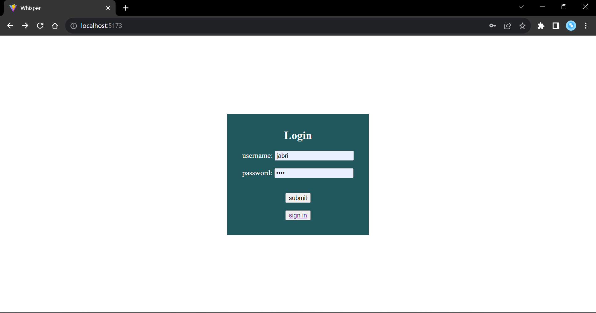
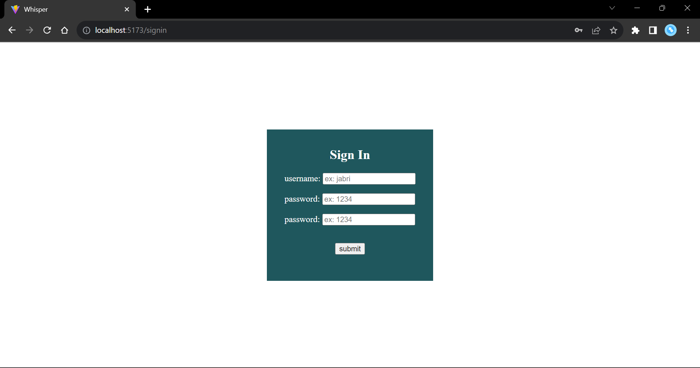
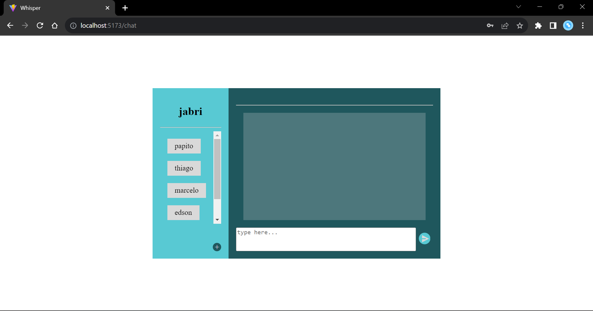
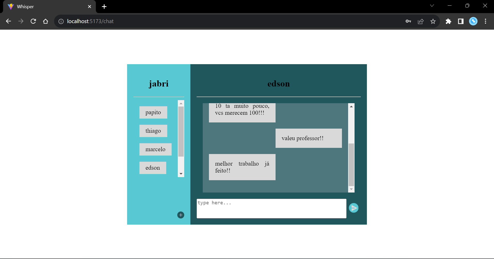
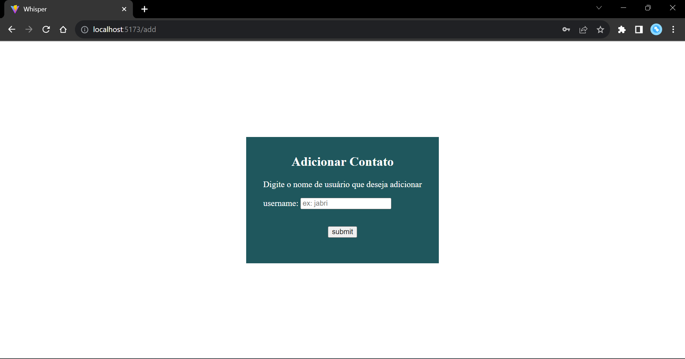

# WHISPER

Frontend para o trabalho final da disciplina de LP3

## requisitos para uso:

#### -baixar a versão recomendada do node.js no link: https://nodejs.org/en
#### -baixar ou fazer um gitclone do repositório
#### -instalar as seguinter bibliotecas pelo comando npm no terminal do diretório do projeto:
npm install react-router-dom yup @reduxjs/toolkit react-redux axios @hookform/resolvers react-hook-form

#### baica uma extensão para o chrome que desetive temporariamente o CORS, por exemplo: https://chromewebstore.google.com/detail/allow-cors-access-control/lhobafahddgcelffkeicbaginigeejlf

## imagens

